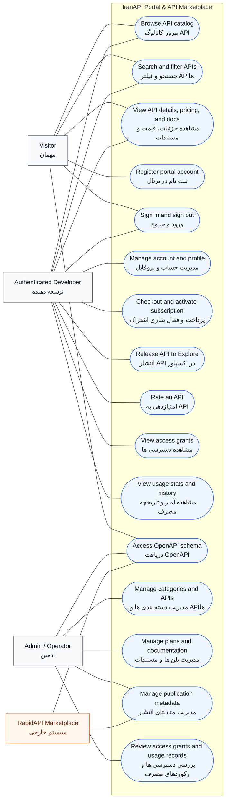

# IranAPI Use Case Diagram

This diagram reflects the current implemented scope of the project after the v1/session-auth, API release, and IranAPI subscription pass.

It intentionally does **not** model:

- live RapidAPI webhook ingestion
- local quota enforcement driven by external subscriptions

Those flows are still outside the currently implemented product boundary.

## Rendered Diagram

## Actors

- `Visitor / مهمان`: browses the public catalog, reads documentation, and can create a portal account.
- `Authenticated Developer / توسعه دهنده`: manages the portal account, checks out subscription plans, publishes APIs, views access and usage, and rates APIs.
- `Admin / Operator / ادمین`: manages catalog content, pricing plans, documentation, publication metadata, and access records.
- `RapidAPI Marketplace / سیستم خارجی`: consumes schema/publication-facing metadata and represents the external marketplace boundary.

## Notes

- User subscription plans are implemented inside IranAPI through checkout sessions and confirmation endpoints in the versioned API.
- Public API access grants can still map external marketplace metadata, but the primary portal subscription state is IranAPI-managed.
- Legacy token and API-key routes still exist for compatibility, but they are not the primary use-case model anymore.
- The canonical system contract for this diagram is the versioned `/api/v1/` API surface.

## Editable Source

If you want a proper UML use-case source file for PlantUML, use:

- [docs/use-case-diagram.puml](/abs/path/will/be/linked/in-chat)
